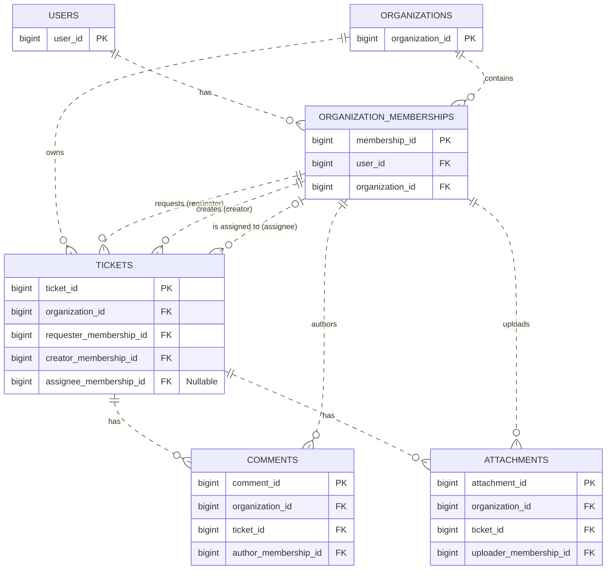

# Relational ERD

Design baseline: Week 09 Wednesday, 9 September 2026.

This diagram shows physical table identities and relationship columns. The
[relational model](relational-model.md) supplies the remaining fields, composite
key groups, deletion behavior, and limits of database enforcement.
No schema or migration has been applied.

## Reading the Diagram

- Every table has its own surrogate primary key; relationship lines are dashed.
- Each membership has exactly one User and one Organization. The diagram shows
  the general FK cardinality of zero or more memberships per Organization; the
  stronger rule requiring an active Organization to have one active owner is
  conditional and is documented separately.
- Each Ticket has exactly one Organization, requester, and creator, and zero or
  one current assignee. A membership may participate in many Tickets in each role.
- Every Comment and Attachment has exactly one Ticket and one attributed membership.
- Repeated FK markers do not define composite groups. All participant relationships
  include the same organization_id as the record's parent context.

## Composite Groups

| Table | UNIQUE group | Purpose |
| --- | --- | --- |
| organization_memberships | (user_id, organization_id) | One membership per User-Organization pair across states |
| organization_memberships | (organization_id, membership_id) | Target for organization-scoped participant FKs |
| tickets | (organization_id, ticket_id) | Target for organization-scoped child FKs |

The last two groups are structural FK targets, not new business uniqueness rules.
See the [foreign key inventory](relational-model.md#foreign-key-inventory) for the
exact source/target column pairs. Every listed FK uses ON DELETE RESTRICT.

The owner partial unique index, role/status CHECKs, active-state checks, operation
permissions, immutable application fields, and transaction protocol are not encoded
by the relationship lines. An ERD alone is not the complete authorization design.
